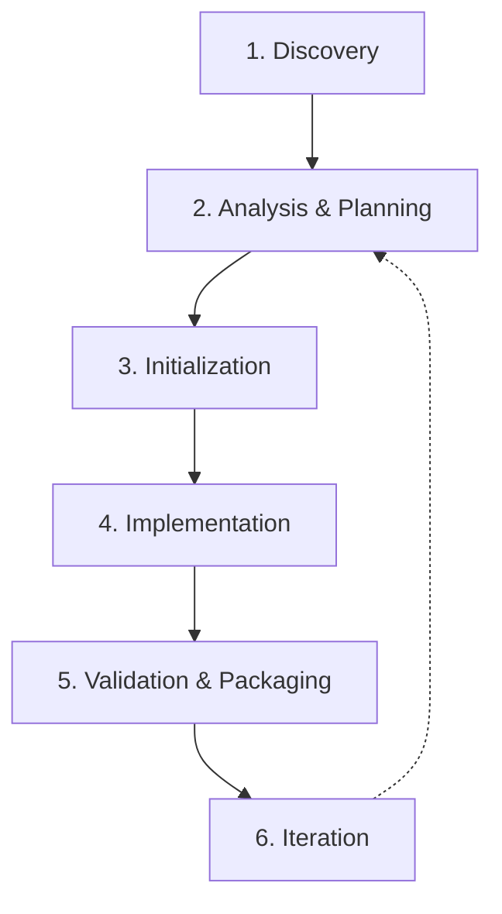
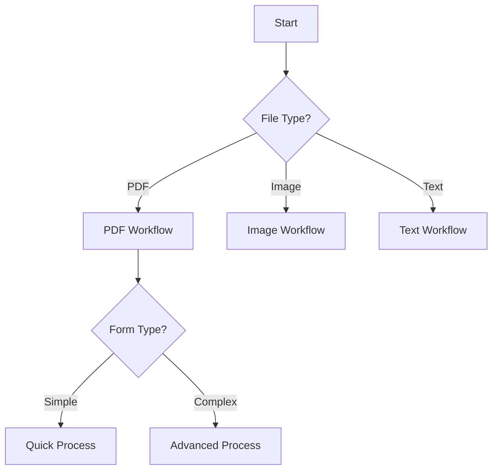
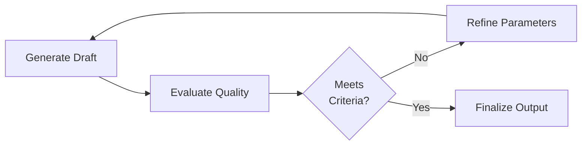

# Skill Creator Pro - Framework Técnico Completo

## 📋 Índice de Contenidos

1. [Arquitectura y Fundamentos](#arquitectura-y-fundamentos)
2. [Metodología de Desarrollo](#metodología-de-desarrollo)
3. [Estructura Técnica de Archivos](#estructura-técnica-de-archivos)
4. [Patrones de Diseño](#patrones-de-diseño)
5. [Sistema de Scripts](#sistema-de-scripts)
6. [Validación y Testing](#validación-y-testing)
7. [Optimización de Context Window](#optimización-de-context-window)
8. [Casos de Uso Especializados](#casos-de-uso-especializados)

---

## 1. Arquitectura y Fundamentos

### 1.1 Modelo Conceptual

Las skills son **paquetes modulares autocontenidos** que extienden las capacidades de Claude mediante:

```
┌─────────────────────────────────────────────────────────┐
│                      SKILL PACKAGE                       │
├─────────────────────────────────────────────────────────┤
│  ┌──────────────┐  ┌──────────────┐  ┌──────────────┐  │
│  │   Metadata   │  │  Procedural  │  │   Bundled    │  │
│  │   (YAML)     │→ │  Knowledge   │→ │  Resources   │  │
│  │              │  │   (Markdown) │  │  (Scripts+)  │  │
│  └──────────────┘  └──────────────┘  └──────────────┘  │
│         ↓                  ↓                  ↓          │
│    Triggering      Workflow Logic      Execution Tools  │
└─────────────────────────────────────────────────────────┘
```

**Tres niveles de carga progresiva:**
- **Nivel 0 (Metadata)**: Siempre en contexto (~100 palabras)
- **Nivel 1 (SKILL.md)**: Cargado cuando se activa (<5k palabras)
- **Nivel 2 (Resources)**: Cargado según necesidad (ilimitado)

### 1.2 Principios de Diseño Técnico

#### Principio 1: Economía de Tokens
```
Costo(skill) = tokens_metadata + tokens_body + tokens_resources_cargados

Optimizar para:
  - Minimizar tokens_body mediante progressive disclosure
  - Maximizar valor informativo por token
  - Evitar redundancia entre niveles
```

**Heurística:** Si Claude ya lo sabe (conocimiento general), no lo incluyas.

#### Principio 2: Grados de Libertad Apropiados

```python
# Mapeo Fragilidad → Restricción
fragilidad_alta = {
    "método": "scripts específicos",
    "parámetros": "mínimos",
    "validación": "estricta",
    "ejemplo": "operaciones de API críticas"
}

fragilidad_media = {
    "método": "pseudocódigo + parámetros",
    "parámetros": "configurables",
    "validación": "moderada",
    "ejemplo": "procesamiento de datos con variantes"
}

fragilidad_baja = {
    "método": "instrucciones textuales",
    "parámetros": "contextuales",
    "validación": "flexible",
    "ejemplo": "análisis exploratorio de datos"
}
```

#### Principio 3: Separación de Concerns

```
SKILL.md        →  Qué hacer y cuándo (workflow)
scripts/        →  Cómo hacerlo (implementación)
references/     →  Información de referencia (conocimiento)
assets/         →  Recursos de salida (templates)
```

---

## 2. Metodología de Desarrollo

### 2.1 Workflow de 6 Fases



### Fase 1: Discovery (Descubrimiento)

**Objetivo:** Definir casos de uso concretos con ejemplos reales.

**Proceso:**
1. **Recolectar ejemplos de uso:** Mínimo 3-5 casos de uso distintos
2. **Identificar patrones:** Qué se repite entre casos
3. **Definir triggers:** Qué palabras/contextos activan la skill
4. **Establecer scope:** Qué entra y qué queda fuera

**Template de Discovery:**
```markdown
### Caso de Uso #1
**Input Usuario:** [Ejemplo real de petición]
**Contexto:** [Situación, archivos disponibles, etc.]
**Output Esperado:** [Qué debe producir Claude]
**Frecuencia:** [Cuán común es este caso]

### Caso de Uso #2
...
```

**Output esperado:**
- Documento con 3-5 casos de uso detallados
- Lista de triggers identificados
- Definición clara del scope

### Fase 2: Analysis & Planning (Análisis y Planificación)

**Objetivo:** Determinar qué recursos son necesarios y cómo estructurarlos.

**Matriz de Decisión de Recursos:**

| Necesidad | Tipo de Recurso | Ubicación | Criterio |
|-----------|----------------|-----------|----------|
| Código que se reescribe idénticamente | Script ejecutable | `scripts/` | Determinismo alto |
| Información de consulta frecuente | Documentación | `references/` | >2 consultas esperadas |
| Templates de salida | Assets | `assets/` | Usado en output |
| Ejemplos de formato | En SKILL.md o references | Depende | <100 líneas → SKILL.md |

**Análisis por Caso de Uso:**

Para cada caso identificado en Fase 1:

```python
def analizar_caso(caso_uso):
    recursos = []
    
    # 1. ¿Qué código se repetiría?
    if hay_codigo_repetitivo:
        recursos.append({
            "tipo": "script",
            "proposito": "automatizar X",
            "lenguaje": "python|bash|...",
            "dependencias": [...]
        })
    
    # 2. ¿Qué información se consultaría?
    if requiere_conocimiento_especifico:
        recursos.append({
            "tipo": "reference",
            "contenido": "esquemas|APIs|policies",
            "tamaño_estimado": "lines"
        })
    
    # 3. ¿Qué templates se necesitan?
    if produce_outputs_estructurados:
        recursos.append({
            "tipo": "asset",
            "formato": "pptx|docx|html|...",
            "uso": "base para output"
        })
    
    return recursos
```

**Output esperado:**
- Tabla de recursos identificados (scripts, references, assets)
- Dependencias técnicas (librerías Python, comandos bash, etc.)
- Estructura preliminar de directorios

### Fase 3: Initialization (Inicialización)

**Objetivo:** Generar estructura base de la skill automáticamente.

**Comando:**
```bash
python scripts/init_skill_pro.py <skill-name> --path <output-dir> --type <tipo>
```

**Tipos de skill:**
- `workflow`: Para procesos secuenciales (ej: DOCX editing)
- `tool-collection`: Para conjunto de herramientas (ej: PDF manipulation)
- `reference`: Para guidelines y estándares (ej: Brand guidelines)
- `analysis`: Para análisis de datos y reporting (ej: Data analytics)
- `integration`: Para integraciones de APIs/sistemas (ej: BigQuery connector)

**Lo que genera el script:**
```
skill-name/
├── SKILL.md (con TODOs específicos del tipo)
├── scripts/
│   ├── __init__.py
│   └── example_operations.py
├── references/
│   └── template_reference.md
├── assets/
│   └── .gitkeep
├── tests/
│   └── test_skill.py
└── README.md (solo para desarrollo, no se empaqueta)
```

**Personalización por tipo:**
El script incluye secciones específicas en SKILL.md según el tipo:
- **workflow**: Incluye plantilla de decision tree y pasos secuenciales
- **tool-collection**: Incluye plantilla de quick start y operaciones categorizadas
- **reference**: Incluye plantilla de especificaciones y guidelines
- **analysis**: Incluye plantilla de methodología analítica y output formats
- **integration**: Incluye plantilla de configuración, autenticación y endpoints

### Fase 4: Implementation (Implementación)

**4.1 Implementación de Scripts**

**Estructura estándar de script:**
```python
#!/usr/bin/env python3
"""
[Descripción breve del propósito del script]

Usage:
    python script_name.py [args]

Dependencies:
    - library1>=1.0.0
    - library2>=2.0.0

Examples:
    $ python script_name.py input.pdf --output result.pdf
"""

import sys
import argparse
from pathlib import Path
from typing import Optional, List, Dict, Any


def validate_inputs(args) -> bool:
    """
    Valida los argumentos de entrada.
    
    Returns:
        bool: True si válidos, False en caso contrario
    """
    # Validación de inputs
    pass


def main_operation(
    input_file: Path,
    output_file: Path,
    **kwargs
) -> Dict[str, Any]:
    """
    Operación principal del script.
    
    Args:
        input_file: Archivo de entrada
        output_file: Archivo de salida
        **kwargs: Parámetros adicionales
    
    Returns:
        Dict con resultados y metadata
    
    Raises:
        ValueError: Si los inputs son inválidos
        IOError: Si hay errores de archivo
    """
    try:
        # Implementación
        result = {
            "status": "success",
            "output_file": str(output_file),
            "metadata": {}
        }
        return result
    
    except Exception as e:
        return {
            "status": "error",
            "message": str(e)
        }


def main():
    parser = argparse.ArgumentParser(
        description="[Descripción del script]"
    )
    parser.add_argument(
        "input",
        type=Path,
        help="Archivo de entrada"
    )
    parser.add_argument(
        "--output",
        type=Path,
        default=None,
        help="Archivo de salida"
    )
    
    args = parser.parse_args()
    
    if not validate_inputs(args):
        sys.exit(1)
    
    result = main_operation(args.input, args.output)
    
    if result["status"] == "success":
        print(f"✅ Operación exitosa: {result['output_file']}")
        sys.exit(0)
    else:
        print(f"❌ Error: {result['message']}")
        sys.exit(1)


if __name__ == "__main__":
    main()
```

**Principios de scripts:**
- **Idempotencia:** Mismos inputs → mismos outputs
- **Atomicidad:** Operación completa o rollback
- **Logging:** Registro de operaciones para debugging
- **Error handling:** Gestión explícita de todos los casos
- **Testing:** Unit tests para funciones críticas

**4.2 Implementación de References**

**Estructura de reference file grande (>100 líneas):**
```markdown
# [Título del Reference]

## Tabla de Contenidos
- [Sección 1](#sección-1)
- [Sección 2](#sección-2)
- [Sección 3](#sección-3)

---

## Sección 1

[Contenido organizado jerárquicamente]

### Subsección 1.1

[Detalles técnicos, esquemas, ejemplos]

### Subsección 1.2

[Más detalles]

---

## Sección 2

...
```

**Tipos de references comunes:**

1. **API Reference:**
```markdown
# API Reference

## Authentication
- Method: Bearer token
- Header: `Authorization: Bearer <token>`

## Endpoints

### GET /users
**Description:** Retrieve user list
**Parameters:**
- `limit` (int, optional): Max results (default: 100)
- `offset` (int, optional): Pagination offset

**Response:**
```json
{
  "users": [...],
  "total": 150,
  "next_offset": 100
}
```

### POST /users
...
```

2. **Schema Reference:**
```markdown
# Database Schema

## Table: users
| Column | Type | Constraints | Description |
|--------|------|-------------|-------------|
| id | INTEGER | PRIMARY KEY | User ID |
| email | VARCHAR(255) | UNIQUE, NOT NULL | Email address |
| created_at | TIMESTAMP | DEFAULT NOW() | Creation date |

## Relationships
- users.id → orders.user_id (1:N)
- users.id → profiles.user_id (1:1)

## Query Patterns
...
```

3. **Workflow Reference:**
```markdown
# Workflow: Data Analysis Pipeline

## Prerequisites
- Data file in CSV/JSON format
- Python 3.8+ with pandas
- Access to database credentials

## Steps

### 1. Data Ingestion
```python
import pandas as pd
df = pd.read_csv('data.csv')
```

### 2. Data Cleaning
- Remove nulls
- Standardize formats
- Validate ranges

### 3. Analysis
...
```

**4.3 Escritura de SKILL.md**

**Estructura recomendada:**

```markdown
---
name: skill-name
description: [Descripción específica con triggers]
---

# [Título de la Skill]

## Overview
[1-2 párrafos del propósito y casos de uso]

## Quick Start
[Ejemplo mínimo funcional - 10 líneas máximo]

## [Sección Principal según tipo]
[Contenido core - workflow, operaciones, o guidelines]

## Advanced Usage
[Casos avanzados, opciones, configuración]

## Troubleshooting
[Problemas comunes y soluciones]

## Resources
[Referencia a scripts/, references/, assets/]
```

**Uso de progressive disclosure en SKILL.md:**

```markdown
## PDF Form Processing

### Quick Path (Simple Forms)
For basic forms with text fields only:

1. Run `scripts/fill_simple_form.py`
2. Provide values in JSON format
3. Generate output

### Advanced Path (Complex Forms)
For forms with:
- Signatures
- Checkboxes
- Dynamic fields
- Validation rules

See [references/advanced_forms.md](references/advanced_forms.md) for:
- Complete field type handling
- Custom validation rules
- Multi-step processing
- Error recovery patterns
```

**Directrices de escritura:**
- **Voz imperativa:** "Run the script", "Use this method", "Check the output"
- **Ejemplos concretos:** Código real que funciona, no pseudocódigo vago
- **Organización visual:** Headers, listas, tablas, code blocks
- **Referencias explícitas:** Enlaces claros a otros archivos
- **Sin redundancia:** Si está en un reference, no lo repitas en SKILL.md

### Fase 5: Validation & Packaging (Validación y Empaquetado)

**5.1 Validación Multi-nivel**

**Nivel 1: Validación Estructural**
```bash
python scripts/validate_skill.py <skill-dir> --level structural
```

Verifica:
- ✓ Existencia de SKILL.md
- ✓ Formato YAML frontmatter
- ✓ Campos requeridos (name, description)
- ✓ Convenciones de naming (hyphen-case)
- ✓ Límites de longitud (name ≤64, description ≤1024)
- ✓ Caracteres prohibidos (< >)

**Nivel 2: Validación de Contenido**
```bash
python scripts/validate_skill.py <skill-dir> --level content
```

Verifica:
- ✓ Referencias a archivos externos existen
- ✓ Scripts tienen permisos de ejecución
- ✓ Code blocks tienen sintaxis válida
- ✓ Enlaces internos funcionan
- ✓ No hay TODOs sin resolver

**Nivel 3: Validación Funcional**
```bash
python scripts/validate_skill.py <skill-dir> --level functional
```

Verifica:
- ✓ Scripts ejecutan sin errores
- ✓ Ejemplos en SKILL.md funcionan
- ✓ Dependencies disponibles
- ✓ Tests pasan (si existen)

**5.2 Testing de Scripts**

**Framework de testing:**
```python
# tests/test_operations.py
import pytest
from pathlib import Path
from scripts.operations import main_operation


def test_main_operation_success():
    """Test operación exitosa con inputs válidos"""
    input_file = Path("tests/fixtures/sample.pdf")
    output_file = Path("/tmp/output.pdf")
    
    result = main_operation(input_file, output_file)
    
    assert result["status"] == "success"
    assert output_file.exists()
    assert output_file.stat().st_size > 0


def test_main_operation_invalid_input():
    """Test manejo de input inválido"""
    input_file = Path("nonexistent.pdf")
    output_file = Path("/tmp/output.pdf")
    
    result = main_operation(input_file, output_file)
    
    assert result["status"] == "error"
    assert "not found" in result["message"].lower()


@pytest.fixture
def sample_data():
    """Fixture para datos de prueba"""
    return {
        "field1": "value1",
        "field2": 42
    }
```

**Ejecutar tests:**
```bash
cd skill-directory
python -m pytest tests/ -v
```

**5.3 Empaquetado**

**Proceso automatizado:**
```bash
python scripts/package_skill.py <skill-dir> --output dist/
```

**Lo que hace el script:**
1. Ejecuta validación completa (structural + content)
2. Limpia archivos de desarrollo (README.md, tests/, *.pyc)
3. Crea archivo .skill (ZIP con extensión .skill)
4. Preserva estructura de directorios
5. Genera checksum MD5

**Estructura del .skill:**
```
skill-name.skill (ZIP)
├── skill-name/
│   ├── SKILL.md
│   ├── scripts/
│   │   └── *.py
│   ├── references/
│   │   └── *.md
│   └── assets/
│       └── *.*
```

**Metadata del paquete:**
```json
{
  "name": "skill-name",
  "version": "1.0.0",
  "created": "2025-10-25T10:30:00Z",
  "size_bytes": 15420,
  "checksum": "a3f2c1b9...",
  "files": 12
}
```

### Fase 6: Iteration (Iteración)

**6.1 Métricas de Evaluación**

Tras usar la skill en casos reales, evaluar:

| Métrica | Pregunta | Objetivo |
|---------|----------|----------|
| **Precision** | ¿Claude hizo lo correcto? | >95% |
| **Efficiency** | ¿Tokens usados apropiadamente? | <80% del límite |
| **Completeness** | ¿Todos los casos cubiertos? | 100% de casos definidos |
| **Usability** | ¿Instructions claras? | 0 confusiones |
| **Maintainability** | ¿Fácil actualizar? | <30min para cambios menores |

**6.2 Ciclo de Mejora**

```
Uso Real → Identificar Gaps → Priorizar → Implementar → Validar → Release
    ↑                                                                  ↓
    └──────────────────────────────────────────────────────────────────┘
```

**Tipos de mejoras:**

1. **Correcciones (Bugs):** Inmediatas
   - Script no funciona
   - Referencia incorrecta
   - Error en documentación

2. **Optimizaciones:** Próxima versión
   - Reducir tokens
   - Mejorar performance
   - Simplificar workflow

3. **Features nuevos:** Planificados
   - Casos de uso adicionales
   - Integraciones nuevas
   - Expansión de capacidades

**Versionado semántico:**
```
MAJOR.MINOR.PATCH

MAJOR: Cambios que rompen compatibilidad
MINOR: Nuevas features retrocompatibles
PATCH: Bug fixes y mejoras menores

Ejemplo: 1.2.3 → 1.3.0 (nuevo feature)
         1.3.0 → 2.0.0 (breaking change)
```

---

## 3. Estructura Técnica de Archivos

### 3.1 Anatomía Completa de una Skill

```
skill-name/                          # Root directory (hyphen-case)
│
├── SKILL.md                         # REQUERIDO: Documento principal
│   ├── YAML frontmatter             # Metadata
│   │   ├── name: (string)          # REQUERIDO
│   │   ├── description: (string)   # REQUERIDO
│   │   └── license: (string)       # OPCIONAL
│   └── Markdown body                # Instrucciones y guías
│
├── scripts/                         # OPCIONAL: Código ejecutable
│   ├── __init__.py                 # Python package marker
│   ├── operations.py               # Operaciones principales
│   ├── utilities.py                # Funciones auxiliares
│   ├── constants.py                # Constantes y configuración
│   └── cli_tool.py                 # CLI interface si aplica
│
├── references/                      # OPCIONAL: Documentación de referencia
│   ├── api_reference.md            # Documentación de APIs
│   ├── schema_reference.md         # Esquemas de datos
│   ├── workflow_guide.md           # Guías de proceso detalladas
│   └── examples/                   # Ejemplos organizados
│       ├── basic.md
│       └── advanced.md
│
├── assets/                          # OPCIONAL: Recursos de output
│   ├── templates/                  # Templates para generar outputs
│   │   ├── report_template.docx
│   │   └── slides_template.pptx
│   ├── images/                     # Imágenes, logos, iconos
│   │   └── logo.png
│   └── boilerplate/                # Código boilerplate
│       └── frontend-app/
│           ├── index.html
│           ├── styles.css
│           └── app.js
│
├── tests/                           # OPCIONAL (no se empaqueta)
│   ├── test_operations.py
│   ├── test_utilities.py
│   └── fixtures/
│       └── sample_data.json
│
├── .gitignore                       # OPCIONAL (para desarrollo)
└── README.md                        # OPCIONAL (para desarrollo, no se empaqueta)
```

### 3.2 Especificación de SKILL.md

#### 3.2.1 YAML Frontmatter

**Campos soportados:**

```yaml
---
# REQUERIDO
name: skill-name              # string, hyphen-case, max 64 chars
description: |                # string, max 1024 chars, sin < >
  Descripción detallada de la skill.
  Incluye cuándo usar, qué hace, triggers.

# OPCIONAL
license: MIT                  # string, tipo de licencia

# OPCIONAL (experimental)
allowed-tools:                # list, restricción de herramientas
  - bash_tool
  - create_file
  - web_search

metadata:                     # dict, metadata adicional
  version: "1.0.0"
  author: "Your Name"
  tags: ["pdf", "forms", "automation"]
---
```

**Validaciones:**
- `name`: Match regex `^[a-z0-9-]+$`, no empieza/termina con `-`, no `--` consecutivos
- `description`: No contiene `<` ni `>`, longitud 1-1024 caracteres
- Otros campos opcionales: permitidos pero no validados estrictamente

#### 3.2.2 Markdown Body

**Elementos soportados:**

1. **Headers (H1-H6):**
   ```markdown
   # H1 - Título principal
   ## H2 - Secciones principales
   ### H3 - Subsecciones
   #### H4 - Sub-subsecciones
   ```

2. **Listas:**
   ```markdown
   - Lista desordenada
   - Otro item
     - Sub-item
   
   1. Lista ordenada
   2. Segundo item
      1. Sub-item numerado
   ```

3. **Code blocks:**
   ````markdown
   ```python
   # Código Python con syntax highlighting
   def example():
       return "Hello"
   ```
   
   ```bash
   # Comandos bash
   ls -la
   ```
   ````

4. **Enlaces:**
   ```markdown
   [Texto visible](references/api_reference.md)
   [External link](https://example.com)
   ```

5. **Énfasis:**
   ```markdown
   **negrita** o __negrita__
   *cursiva* o _cursiva_
   `código inline`
   ```

6. **Tablas:**
   ```markdown
   | Column 1 | Column 2 | Column 3 |
   |----------|----------|----------|
   | Data 1   | Data 2   | Data 3   |
   ```

7. **Blockquotes:**
   ```markdown
   > Nota importante o warning
   > Puede ocupar múltiples líneas
   ```

8. **Horizontal rules:**
   ```markdown
   ---
   ```

### 3.3 Organización de Scripts

#### 3.3.1 Estructura Modular

**Patrón recomendado para skills complejas:**

```
scripts/
├── __init__.py                 # Package initialization
├── core/                       # Core functionality
│   ├── __init__.py
│   ├── operations.py          # Main operations
│   └── validators.py          # Input validation
├── utils/                      # Utilities
│   ├── __init__.py
│   ├── file_handler.py        # File I/O operations
│   └── logger.py              # Logging utilities
├── cli/                        # CLI interfaces
│   ├── __init__.py
│   └── main.py                # CLI entry point
└── config/                     # Configuration
    ├── __init__.py
    └── settings.py            # Default settings
```

**Ejemplo de imports limpios:**
```python
# En scripts/__init__.py
from .core.operations import main_operation, secondary_operation
from .utils.file_handler import read_file, write_file

__all__ = [
    'main_operation',
    'secondary_operation',
    'read_file',
    'write_file'
]
```

**Uso desde SKILL.md:**
```markdown
## Usage

Run the main operation:
```bash
python -m scripts.cli.main input.pdf --output result.pdf
```

Or import in Python:
```python
from scripts import main_operation
result = main_operation("input.pdf", "output.pdf")
```
```

#### 3.3.2 Gestión de Dependencias

**Especificar dependencies en SKILL.md:**
```markdown
## Requirements

### Python Dependencies
Install via pip:
```bash
pip install pdfplumber pandas openpyxl --break-system-packages
```

Required packages:
- `pdfplumber>=0.10.0` - PDF text extraction
- `pandas>=2.0.0` - Data manipulation
- `openpyxl>=3.1.0` - Excel file handling

### System Dependencies
- `poppler-utils` - For PDF rendering (Ubuntu: `apt install poppler-utils`)
- `python3.8+` - Minimum Python version
```

**Checking dependencies en script:**
```python
import sys

REQUIRED_PACKAGES = {
    'pdfplumber': '0.10.0',
    'pandas': '2.0.0',
    'openpyxl': '3.1.0'
}

def check_dependencies():
    """Verifica que las dependencias estén instaladas"""
    missing = []
    
    for package, min_version in REQUIRED_PACKAGES.items():
        try:
            mod = __import__(package)
            version = getattr(mod, '__version__', '0.0.0')
            if version < min_version:
                missing.append(f"{package}>={min_version} (found {version})")
        except ImportError:
            missing.append(f"{package}>={min_version}")
    
    if missing:
        print(f"❌ Missing dependencies:\n  " + "\n  ".join(missing))
        print("\nInstall with:")
        print(f"  pip install {' '.join(missing)} --break-system-packages")
        sys.exit(1)
    
    print("✅ All dependencies satisfied")

if __name__ == "__main__":
    check_dependencies()
    # ... resto del script
```

### 3.4 Organización de References

#### 3.4.1 Nomenclatura y Estructura

**Convenciones de naming:**
- Usar `snake_case.md` para nombres de archivo
- Nombres descriptivos del contenido
- Prefijos para categorización si hay muchos files

**Ejemplos:**
```
references/
├── api_reference.md           # General API docs
├── auth_methods.md            # Authentication specifics
├── data_schema.md             # Data structure definitions
├── workflow_standard.md       # Standard workflows
├── workflow_advanced.md       # Advanced workflows
└── examples/
    ├── basic_usage.md
    ├── advanced_patterns.md
    └── troubleshooting.md
```

#### 3.4.2 Referencias desde SKILL.md

**Patrón de enlace con contexto:**
```markdown
## Advanced Form Processing

For complex forms with dynamic fields, signature handling, and custom validation:

**See [references/advanced_forms.md](references/advanced_forms.md)** for:
- Complete field type specifications (20+ types)
- Custom validation rule syntax
- Multi-page form handling
- Digital signature integration
- Error recovery patterns

Quick example here for simple case:
```python
# Simple text field
fill_field("name", "John Doe")
```
```

**Anti-pattern (no hagas esto):**
```markdown
<!-- MAL: Link sin contexto -->
See advanced_forms.md for more information.

<!-- MAL: Duplicación -->
## Field Types
- Text: stores string values
- Number: stores numeric values
...
[40 líneas de detalles que ya están en el reference]
```

### 3.5 Organización de Assets

#### 3.5.1 Categorización

```
assets/
├── templates/                  # Document templates
│   ├── report.docx
│   ├── presentation.pptx
│   └── spreadsheet.xlsx
├── images/                     # Images, logos, icons
│   ├── logo.png
│   ├── icon_set/
│   │   ├── icon1.svg
│   │   └── icon2.svg
│   └── backgrounds/
│       └── bg_gradient.png
├── fonts/                      # Typography
│   ├── CustomFont-Regular.ttf
│   └── CustomFont-Bold.ttf
├── boilerplate/                # Code templates
│   ├── react-app/
│   │   ├── public/
│   │   └── src/
│   └── python-module/
│       ├── __init__.py
│       └── setup.py
└── data/                       # Sample data
    ├── sample.csv
    └── test_dataset.json
```

#### 3.5.2 Uso de Assets en SKILL.md

**Copiar template y modificar:**
```markdown
## Creating Report

1. Copy the base template:
```bash
cp assets/templates/report.docx /home/claude/my_report.docx
```

2. Open and modify using python-docx:
```python
from docx import Document

doc = Document('/home/claude/my_report.docx')
# Modify sections, add content
doc.save('/mnt/user-data/outputs/final_report.docx')
```
```

**Usar boilerplate como base:**
```markdown
## Creating React App

1. Copy boilerplate to working directory:
```bash
cp -r assets/boilerplate/react-app /home/claude/my-app
cd /home/claude/my-app
```

2. Customize for user's needs:
```javascript
// Edit src/App.js
import React from 'react';

function App() {
  // User's custom logic here
  return <div>...</div>;
}
```

3. Move to outputs when ready:
```bash
cp -r /home/claude/my-app /mnt/user-data/outputs/
```
```

---

## 4. Patrones de Diseño

### 4.1 Workflow Patterns

#### 4.1.1 Sequential Workflow

**Uso:** Procesos con pasos claros y ordenados.

**Estructura:**
```markdown
## Process Overview

This workflow consists of 5 sequential steps:

1. **Data Ingestion** - Load and validate input data
2. **Data Cleaning** - Remove nulls, standardize formats
3. **Analysis** - Compute statistics and metrics
4. **Visualization** - Generate charts and graphs
5. **Report Generation** - Compile results into document

---

## Step 1: Data Ingestion

### Objective
Load data from CSV/JSON/Excel and validate structure.

### Implementation
```python
import pandas as pd

df = pd.read_csv('data.csv')

# Validate required columns
required_cols = ['id', 'date', 'value']
assert all(col in df.columns for col in required_cols)
```

### Success Criteria
- ✓ Data loaded without errors
- ✓ All required columns present
- ✓ Row count > 0

### Troubleshooting
- **Error: File not found** → Check file path
- **Error: Missing column** → Verify data source

---

## Step 2: Data Cleaning
...
```

**Ventajas:**
- Claridad en el orden de ejecución
- Fácil debugging (sabes en qué paso fallaste)
- Verificación punto por punto

#### 4.1.2 Conditional Workflow

**Uso:** Procesos con ramificaciones basadas en condiciones.

**Estructura:**
```markdown
## Workflow Decision Tree



---

## Decision Point 1: Determine File Type

Check file extension to route to appropriate workflow:

```python
file_ext = Path(filename).suffix.lower()

if file_ext == '.pdf':
    # Follow PDF Workflow
    process_pdf(filename)
elif file_ext in ['.jpg', '.png', '.gif']:
    # Follow Image Workflow
    process_image(filename)
elif file_ext in ['.txt', '.md']:
    # Follow Text Workflow
    process_text(filename)
else:
    raise ValueError(f"Unsupported file type: {file_ext}")
```

---

## PDF Workflow

### Decision Point 2: Identify Form Complexity

Run analysis to determine form type:

```bash
python scripts/analyze_pdf_form.py input.pdf
```

Output will indicate:
- **Simple Form** → Has only text fields → Use Quick Process
- **Complex Form** → Has signatures, checkboxes, etc. → Use Advanced Process

### Quick Process (Simple Forms)
1. Extract field names
2. Fill with provided data
3. Generate output

See: `scripts/quick_fill.py`

### Advanced Process (Complex Forms)
1. Analyze form structure
2. Map field types
3. Apply specialized handlers
4. Validate output

See: [references/advanced_forms.md](references/advanced_forms.md)

---

## Image Workflow
...
```

**Ventajas:**
- Maneja múltiples casos de uso
- Decision points explícitos
- Workflows independientes pero conectados

#### 4.1.3 Iterative Workflow

**Uso:** Procesos que se repiten hasta cumplir criterio.

**Estructura:**
```markdown
## Iterative Refinement Process

This workflow refines output through multiple iterations:



### Algorithm

```python
MAX_ITERATIONS = 5
quality_threshold = 0.85

for iteration in range(1, MAX_ITERATIONS + 1):
    print(f"Iteration {iteration}/{MAX_ITERATIONS}")
    
    # Generate output
    output = generate_draft(parameters)
    
    # Evaluate quality
    quality_score = evaluate_quality(output)
    print(f"Quality score: {quality_score:.2f}")
    
    # Check if meets criteria
    if quality_score >= quality_threshold:
        print("✅ Quality threshold met!")
        break
    
    # Refine parameters for next iteration
    parameters = refine_parameters(parameters, quality_score)
else:
    print("⚠️ Max iterations reached without meeting threshold")

# Finalize
finalize_output(output)
```

### Quality Evaluation Criteria

- **Completeness:** All required sections present
- **Accuracy:** Data matches source within 5% margin
- **Format:** Follows template structure
- **Readability:** Grammar and style scores >80%

### Parameter Refinement Strategy

Based on quality score gaps:
- If accuracy low → Adjust data processing parameters
- If format issues → Modify template application
- If readability poor → Adjust language model parameters
```

**Ventajas:**
- Mejora incremental de resultados
- Criteria explícitos de éxito
- Control sobre iteraciones máximas

### 4.2 Output Patterns

#### 4.2.1 Template Pattern (Strict)

**Uso:** Outputs que DEBEN seguir formato exacto (APIs, data exports, legal docs).

**Estructura:**
```markdown
## Output Format

**CRITICAL:** Output MUST follow this exact structure. Do not deviate.

### Report Structure

```markdown
# [Project Name] - Analysis Report

**Date:** YYYY-MM-DD
**Analyst:** [Name]
**Version:** X.Y.Z

---

## Executive Summary

[Single paragraph, 100-150 words, covering: purpose, method, key finding, recommendation]

---

## Data Overview

### Dataset Characteristics
- **Total Records:** [number]
- **Date Range:** YYYY-MM-DD to YYYY-MM-DD
- **Key Variables:** [var1, var2, var3]

---

## Analysis Results

### Finding 1: [Title]
**Metric:** [value with units]
**Significance:** [p-value if applicable]
**Interpretation:** [2-3 sentences explaining what this means]

### Finding 2: [Title]
...

---

## Recommendations

1. **[Action Item]**
   - Priority: High/Medium/Low
   - Timeline: [timeframe]
   - Expected Impact: [brief description]

2. **[Action Item]**
   ...

---

## Appendix

### Methodology
[Brief description of analysis method]

### Data Sources
- Source 1: [description]
- Source 2: [description]
```

### Validation Checklist

Before finalizing, verify:
- [ ] All section headers present exactly as specified
- [ ] Executive summary is 100-150 words
- [ ] Each finding includes metric, significance, interpretation
- [ ] Recommendations numbered with priority/timeline/impact
- [ ] Appendix includes methodology and sources
```

**Ventajas:**
- Garantiza consistencia
- Facilita parsing automatizado
- Cumple requisitos estrictos

#### 4.2.2 Template Pattern (Flexible)

**Uso:** Outputs donde estructura ayuda pero adaptación es valiosa.

**Estructura:**
```markdown
## Report Structure (Flexible Template)

Use this as a starting point, but adapt based on findings:

```markdown
# [Analysis Title]

## Summary
[Brief overview - adjust length based on complexity]

## Key Insights
[Organize findings in a way that tells the story]
[You might use subsections, tables, or bullet points]
[More sections if needed, fewer if findings are simple]

## Supporting Details
[Additional context, methodology, data sources]
[Optional: can be moved to appendix if report is long]

## Next Steps
[Recommendations tailored to the specific context]
```

### Adaptation Guidelines

**For simple analysis:**
- Combine Summary and Key Insights
- Skip Supporting Details if self-evident
- Keep to 1-2 pages

**For complex analysis:**
- Expand Key Insights into multiple themed sections
- Add detailed methodology in Supporting Details
- Include visualizations and data tables
- 5-10 pages acceptable

**For technical audience:**
- Front-load statistical details
- Include code snippets or algorithms
- Reference technical specifications

**For executive audience:**
- Expand Summary to cover most important points
- Simplify or abbreviate technical details
- Focus on actionable recommendations
```

**Ventajas:**
- Balance entre estructura y flexibilidad
- Adaptable a audiencia
- Guidance sin rigidez

#### 4.2.3 Examples Pattern

**Uso:** Cuando calidad depende de imitar estilo o formato específico.

**Estructura:**
```markdown
## Commit Message Format

Generate commit messages following these patterns:

### Example 1: Feature Addition

**Input:** Added user authentication system with JWT tokens and refresh token mechanism

**Output:**
```
feat(auth): implement JWT-based authentication system

- Add login/logout endpoints
- Implement JWT token generation and validation
- Add refresh token mechanism for extended sessions
- Include middleware for route protection
- Add unit tests for auth flows

Closes #142
```

**Rationale:** 
- Type: `feat` for new functionality
- Scope: `auth` indicating authentication module
- Summary: concise, imperative mood
- Body: detailed bullets covering what was done
- Footer: references issue number

### Example 2: Bug Fix

**Input:** Fixed issue where date picker displayed wrong month when year changed

**Output:**
```
fix(ui): correct month display in date picker during year change

When year changes while a date is selected, the component
was displaying the wrong month due to state update race condition.

Fixed by ensuring year and month updates are batched in single
setState call.

Bug introduced in: v2.3.0
Fixes #287
```

**Rationale:**
- Type: `fix` for bug fixes
- Scope: `ui` for user interface component
- Summary: describes the issue that was fixed
- Body: explains problem and solution
- Footer: traces bug origin and references issue

### Example 3: Refactoring

**Input:** Reorganized database query functions into separate modules by domain

**Output:**
```
refactor(db): modularize query functions by domain

Reorganized database query functions from single file into
domain-specific modules for better maintainability:

- users/queries.py: user-related queries
- orders/queries.py: order-related queries
- products/queries.py: product-related queries

No functional changes. All existing tests pass.
```

**Rationale:**
- Type: `refactor` for code reorganization
- Scope: `db` for database layer
- Summary: high-level description of change
- Body: specifics of reorganization
- Note about no functional changes

---

## Style Guidelines

From examples above, follow:

1. **Type prefixes:** feat, fix, refactor, docs, test, chore
2. **Scope in parens:** (auth), (ui), (db), (api), etc.
3. **Summary line:** <50 chars, imperative mood, no period
4. **Body:** Blank line after summary, then detailed explanation
5. **Footer:** Reference issues/PRs with `Closes #N` or `Fixes #N`
```

**Ventajas:**
- Ejemplos concretos más efectivos que descripción abstracta
- Muestra estilo y nivel de detalle deseado
- Facilita imitación precisa

### 4.3 Integration Patterns

#### 4.3.1 API Integration Pattern

**Uso:** Skills que interactúan con APIs externas.

**Estructura:**
```markdown
## API Integration Overview

This skill integrates with the [Service Name] API for [purpose].

### Authentication

**Method:** Bearer token authentication

**Setup:**
1. Obtain API token from [Service dashboard](https://example.com/dashboard)
2. Store in environment variable:
   ```bash
   export SERVICE_API_KEY="your_token_here"
   ```

**Usage in code:**
```python
import os
headers = {
    "Authorization": f"Bearer {os.environ['SERVICE_API_KEY']}",
    "Content-Type": "application/json"
}
```

---

## API Operations

### 1. Fetch Data

**Endpoint:** `GET /api/v1/data`

**Parameters:**
- `start_date` (string, required): ISO 8601 date (YYYY-MM-DD)
- `end_date` (string, required): ISO 8601 date
- `limit` (int, optional): Max results, default 100

**Example:**
```python
import requests

response = requests.get(
    "https://api.example.com/v1/data",
    headers=headers,
    params={
        "start_date": "2025-01-01",
        "end_date": "2025-01-31",
        "limit": 50
    }
)

data = response.json()
```

**Response:**
```json
{
  "data": [...],
  "total": 150,
  "page": 1,
  "has_more": true
}
```

### 2. Create Resource

**Endpoint:** `POST /api/v1/resources`

**Payload:**
```json
{
  "name": "Resource Name",
  "type": "document",
  "metadata": {
    "author": "John Doe",
    "tags": ["important", "review"]
  }
}
```

**Example:**
```python
payload = {
    "name": "My Document",
    "type": "document",
    "metadata": {
        "author": "John Doe",
        "tags": ["important"]
    }
}

response = requests.post(
    "https://api.example.com/v1/resources",
    headers=headers,
    json=payload
)

resource_id = response.json()["id"]
```

---

## Error Handling

### Common Errors

| Status Code | Meaning | Action |
|-------------|---------|--------|
| 401 | Invalid token | Check API_KEY environment variable |
| 403 | Insufficient permissions | Verify API token permissions |
| 429 | Rate limit exceeded | Implement exponential backoff |
| 500 | Server error | Retry with exponential backoff |

### Retry Logic

```python
import time
from requests.adapters import HTTPAdapter
from requests.packages.urllib3.util.retry import Retry

def get_session_with_retries():
    session = requests.Session()
    retry = Retry(
        total=3,
        backoff_factor=1,
        status_forcelist=[429, 500, 502, 503, 504]
    )
    adapter = HTTPAdapter(max_retries=retry)
    session.mount('https://', adapter)
    return session

# Usage
session = get_session_with_retries()
response = session.get(url, headers=headers)
```

---

## Rate Limiting

- **Limit:** 100 requests per minute
- **Recommendation:** Implement request queuing

```python
import time
from collections import deque

class RateLimiter:
    def __init__(self, max_calls, period):
        self.max_calls = max_calls
        self.period = period
        self.calls = deque()
    
    def __call__(self, func):
        def wrapper(*args, **kwargs):
            now = time.time()
            # Remove old calls
            while self.calls and self.calls[0] < now - self.period:
                self.calls.popleft()
            
            # Wait if at limit
            if len(self.calls) >= self.max_calls:
                sleep_time = self.period - (now - self.calls[0])
                time.sleep(sleep_time)
            
            # Record call
            self.calls.append(time.time())
            return func(*args, **kwargs)
        return wrapper

# Usage
@RateLimiter(max_calls=100, period=60)
def api_call():
    return requests.get(url, headers=headers)
```

---

## Testing

Use provided test credentials for development:

```python
# Test environment
TEST_API_KEY = "test_key_do_not_use_in_production"
TEST_BASE_URL = "https://api-test.example.com"

# Test mode detection
if os.environ.get('ENV') == 'test':
    API_KEY = TEST_API_KEY
    BASE_URL = TEST_BASE_URL
else:
    API_KEY = os.environ['SERVICE_API_KEY']
    BASE_URL = "https://api.example.com"
```

---

## Complete Reference

For full API documentation, see:
[references/api_complete_reference.md](references/api_complete_reference.md)
```

#### 4.3.2 Database Integration Pattern

**Uso:** Skills que consultan o manipulan bases de datos.

**Estructura:**
```markdown
## Database Integration

This skill connects to [Database Type] for [purpose].

### Connection Setup

**Requirements:**
- Database: PostgreSQL 13+
- Python package: `psycopg2-binary>=2.9.0`

**Connection String:**
```python
import os
from urllib.parse import quote_plus

DB_CONFIG = {
    "host": os.environ.get("DB_HOST", "localhost"),
    "port": int(os.environ.get("DB_PORT", 5432)),
    "database": os.environ["DB_NAME"],
    "user": os.environ["DB_USER"],
    "password": os.environ["DB_PASSWORD"]
}

# For SQLAlchemy
connection_string = (
    f"postgresql://{DB_CONFIG['user']}:"
    f"{quote_plus(DB_CONFIG['password'])}"
    f"@{DB_CONFIG['host']}:{DB_CONFIG['port']}"
    f"/{DB_CONFIG['database']}"
)
```

### Schema Overview

See [references/database_schema.md](references/database_schema.md) for complete schema documentation.

**Key tables:**
- `users` - User accounts and profiles
- `orders` - Order transactions
- `products` - Product catalog

**Quick reference:**
```sql
-- users table
id          | serial      | PRIMARY KEY
email       | varchar(255)| UNIQUE NOT NULL
created_at  | timestamp   | DEFAULT NOW()

-- orders table
id          | serial      | PRIMARY KEY
user_id     | integer     | FOREIGN KEY → users(id)
total_amount| decimal(10,2)| NOT NULL
status      | varchar(50) | NOT NULL
order_date  | timestamp   | DEFAULT NOW()
```

### Common Queries

#### 1. Fetch User Orders

```python
import psycopg2

def get_user_orders(user_id, start_date=None, end_date=None):
    """
    Retrieve all orders for a user within date range.
    
    Args:
        user_id: User ID
        start_date: Optional start date (YYYY-MM-DD)
        end_date: Optional end date (YYYY-MM-DD)
    
    Returns:
        List of order dictionaries
    """
    conn = psycopg2.connect(**DB_CONFIG)
    cursor = conn.cursor()
    
    query = """
        SELECT 
            o.id,
            o.order_date,
            o.total_amount,
            o.status,
            COUNT(oi.id) as item_count
        FROM orders o
        LEFT JOIN order_items oi ON o.id = oi.order_id
        WHERE o.user_id = %s
    """
    params = [user_id]
    
    if start_date:
        query += " AND o.order_date >= %s"
        params.append(start_date)
    
    if end_date:
        query += " AND o.order_date <= %s"
        params.append(end_date)
    
    query += """
        GROUP BY o.id, o.order_date, o.total_amount, o.status
        ORDER BY o.order_date DESC
    """
    
    cursor.execute(query, params)
    
    columns = [desc[0] for desc in cursor.description]
    results = [dict(zip(columns, row)) for row in cursor.fetchall()]
    
    cursor.close()
    conn.close()
    
    return results
```

#### 2. Insert Order

```python
def create_order(user_id, items, shipping_address):
    """
    Create new order with items.
    
    Args:
        user_id: User ID
        items: List of dicts with product_id, quantity, price
        shipping_address: Dict with address fields
    
    Returns:
        Order ID of created order
    """
    conn = psycopg2.connect(**DB_CONFIG)
    cursor = conn.cursor()
    
    try:
        # Start transaction
        cursor.execute("BEGIN")
        
        # Calculate total
        total = sum(item['price'] * item['quantity'] for item in items)
        
        # Insert order
        cursor.execute("""
            INSERT INTO orders (user_id, total_amount, status)
            VALUES (%s, %s, 'pending')
            RETURNING id
        """, (user_id, total))
        
        order_id = cursor.fetchone()[0]
        
        # Insert order items
        for item in items:
            cursor.execute("""
                INSERT INTO order_items (order_id, product_id, quantity, price)
                VALUES (%s, %s, %s, %s)
            """, (order_id, item['product_id'], item['quantity'], item['price']))
        
        # Insert shipping address
        cursor.execute("""
            INSERT INTO shipping_addresses (order_id, street, city, state, zip)
            VALUES (%s, %s, %s, %s, %s)
        """, (order_id, shipping_address['street'], shipping_address['city'],
              shipping_address['state'], shipping_address['zip']))
        
        # Commit transaction
        cursor.execute("COMMIT")
        
        return order_id
        
    except Exception as e:
        cursor.execute("ROLLBACK")
        raise e
    
    finally:
        cursor.close()
        conn.close()
```

### Connection Pooling

For high-frequency queries, use connection pooling:

```python
from psycopg2 import pool

# Initialize pool (do this once)
connection_pool = pool.SimpleConnectionPool(
    minconn=1,
    maxconn=10,
    **DB_CONFIG
)

def get_connection():
    """Get connection from pool"""
    return connection_pool.getconn()

def return_connection(conn):
    """Return connection to pool"""
    connection_pool.putconn(conn)

# Usage
conn = get_connection()
try:
    cursor = conn.cursor()
    cursor.execute("SELECT * FROM users WHERE id = %s", (user_id,))
    result = cursor.fetchone()
finally:
    cursor.close()
    return_connection(conn)
```

### Security Best Practices

1. **Never concatenate SQL strings:**
   ```python
   # ❌ WRONG - SQL injection vulnerable
   cursor.execute(f"SELECT * FROM users WHERE email = '{email}'")
   
   # ✅ CORRECT - Use parameterized queries
   cursor.execute("SELECT * FROM users WHERE email = %s", (email,))
   ```

2. **Use transactions for multi-step operations**

3. **Store credentials in environment variables, not code**

4. **Use read-only credentials when only reading**
```

---

## 5. Sistema de Scripts

### 5.1 Script: init_skill_pro.py

**Propósito:** Inicializar estructura de skill con templates inteligentes según tipo.

**Ubicación:** `scripts/init_skill_pro.py`

**Mejoras sobre versión base:**
- Tipos de skill predefinidos
- Templates contextualizados
- Generación de tests
- Configuración de validadores

**Código:**

Ver archivo `scripts/init_skill_pro.py` en la skill empaquetada para implementación completa.

**Uso:**
```bash
python scripts/init_skill_pro.py my-analysis-skill \
    --path /home/claude/skills \
    --type analysis \
    --author "Your Name" \
    --tags "data,analysis,reporting"
```

### 5.2 Script: validate_skill_pro.py

**Propósito:** Validación multi-nivel con reporting detallado.

**Niveles:**
1. **Structural:** Formato, campos requeridos, convenciones
2. **Content:** Referencias, sintaxis, completeness
3. **Functional:** Ejecución de scripts, tests, dependencies

**Uso:**
```bash
# Validación rápida (structural)
python scripts/validate_skill_pro.py skill-dir

# Validación completa
python scripts/validate_skill_pro.py skill-dir --level all

# Validación con auto-fix
python scripts/validate_skill_pro.py skill-dir --fix
```

Ver archivo `scripts/validate_skill_pro.py` en la skill empaquetada para implementación completa.

### 5.3 Script: package_skill_pro.py

**Propósito:** Empaquetado con validación, limpieza y metadata.

**Features:**
- Validación automática pre-package
- Limpieza de archivos de desarrollo
- Generación de manifest.json
- Cálculo de checksums
- Compresión optimizada

**Uso:**
```bash
# Package básico
python scripts/package_skill_pro.py skill-dir

# Package con output específico y metadata
python scripts/package_skill_pro.py skill-dir \
    --output dist/ \
    --version 1.2.0 \
    --notes "Added support for X"
```

Ver archivo `scripts/package_skill_pro.py` en la skill empaquetada para implementación completa.

### 5.4 Script: analyze_skill.py

**Propósito:** Análisis de métricas y optimización de skills.

**Métricas analizadas:**
- Token usage (metadata, body, references)
- Complejidad (cyclomatic complexity de scripts)
- Coverage (% de casos de uso documentados)
- Dependencies (versiones, conflictos)
- Link integrity (referencias válidas)

**Uso:**
```bash
python scripts/analyze_skill.py skill-dir --report detailed
```

**Output ejemplo:**
```
📊 Skill Analysis Report: my-skill
═══════════════════════════════════════════

📝 Token Usage
  Metadata:    87 tokens (target: <100)   ✅
  SKILL.md:    2,847 tokens (target: <5000) ✅
  References:  12,456 tokens (lazy loaded)  ✅
  
⚙️ Complexity
  Scripts: 4 files, avg complexity: 5.2    ✅
  Tests: 12 test cases, 87% coverage      ⚠️
  
🔗 Link Integrity
  Internal links: 15/15 valid             ✅
  External links: 3/3 accessible          ✅
  
📦 Dependencies
  Python: 5 packages, all compatible      ✅
  System: 2 tools, all available          ✅
  
💡 Recommendations
  1. Increase test coverage (target: >90%)
  2. Consider splitting large reference file (api_ref.md > 500 lines)
  3. Add docstrings to 2 functions in utilities.py
```

Ver archivo `scripts/analyze_skill.py` en la skill empaquetada para implementación completa.

---

## 6. Validación y Testing

### 6.1 Checklist de Validación

#### Validación Estructural

```markdown
### SKILL.md Frontmatter
- [ ] Archivo SKILL.md existe en root
- [ ] Frontmatter válido (delimitado por ---)
- [ ] Campo `name` presente (hyphen-case, ≤64 chars)
- [ ] Campo `description` presente (≤1024 chars, sin <>)
- [ ] Nombre del directorio coincide con campo `name`
- [ ] No hay campos no permitidos en frontmatter

### SKILL.md Body
- [ ] Contiene markdown válido
- [ ] Headers siguen jerarquía (no saltar de H1 a H3)
- [ ] Code blocks tienen lenguaje especificado
- [ ] Listas tienen formato consistente
- [ ] No hay TODOs sin resolver

### File Organization
- [ ] Scripts en directorio `scripts/`
- [ ] Referencias en directorio `references/`
- [ ] Assets en directorio `assets/`
- [ ] No hay archivos extranos (README.md, etc.)
```

#### Validación de Contenido

```markdown
### Internal References
- [ ] Todos los links a `references/` apuntan a archivos existentes
- [ ] Todos los links a `scripts/` apuntan a archivos existentes
- [ ] Todos los links a `assets/` apuntan a archivos existentes
- [ ] Paths son relativos, no absolutos

### Scripts
- [ ] Scripts tienen shebang (#!/usr/bin/env python3)
- [ ] Scripts tienen permisos de ejecución
- [ ] Scripts tienen docstrings
- [ ] Scripts manejan errores explícitamente
- [ ] Scripts validan inputs

### Code Blocks
- [ ] Code blocks son sintácticamente válidos
- [ ] Ejemplos son reproducibles
- [ ] Comandos de instalación funcionan

### Dependencies
- [ ] Todas las dependencias listadas en SKILL.md
- [ ] Versiones especificadas para dependencias críticas
- [ ] Instrucciones de instalación claras
```

#### Validación Funcional

```markdown
### Script Execution
- [ ] Todos los scripts ejecutan sin errores en casos básicos
- [ ] Scripts retornan códigos de salida apropiados
- [ ] Scripts producen outputs esperados

### Tests (si existen)
- [ ] Todos los tests pasan
- [ ] Coverage >80% para código crítico
- [ ] Tests cubren casos edge

### Examples
- [ ] Ejemplos en SKILL.md son reproducibles
- [ ] Outputs de ejemplos coinciden con lo documentado
- [ ] Ejemplos cubren casos de uso principales
```

### 6.2 Testing Framework

#### Estructura de Tests

```
tests/
├── __init__.py
├── conftest.py                 # Pytest configuration and fixtures
├── test_operations.py          # Tests for main operations
├── test_utilities.py           # Tests for utility functions
├── test_integration.py         # Integration tests
└── fixtures/                   # Test data
    ├── sample_input.pdf
    ├── expected_output.json
    └── test_config.yaml
```

#### conftest.py Template

```python
# tests/conftest.py
import pytest
from pathlib import Path

@pytest.fixture
def fixtures_dir():
    """Path to fixtures directory"""
    return Path(__file__).parent / "fixtures"

@pytest.fixture
def sample_input(fixtures_dir):
    """Sample input file"""
    return fixtures_dir / "sample_input.pdf"

@pytest.fixture
def temp_output_dir(tmp_path):
    """Temporary directory for test outputs"""
    output_dir = tmp_path / "outputs"
    output_dir.mkdir()
    return output_dir

@pytest.fixture
def mock_api_response():
    """Mock API response data"""
    return {
        "status": "success",
        "data": {
            "id": 12345,
            "name": "Test Item"
        }
    }
```

#### Test Examples

```python
# tests/test_operations.py
import pytest
from pathlib import Path
from scripts.operations import main_operation, validate_input

class TestMainOperation:
    def test_success_with_valid_input(self, sample_input, temp_output_dir):
        """Test successful operation with valid input"""
        output_file = temp_output_dir / "output.pdf"
        
        result = main_operation(sample_input, output_file)
        
        assert result["status"] == "success"
        assert output_file.exists()
        assert output_file.stat().st_size > 0
    
    def test_error_with_missing_input(self, temp_output_dir):
        """Test error handling with missing input file"""
        input_file = Path("nonexistent.pdf")
        output_file = temp_output_dir / "output.pdf"
        
        result = main_operation(input_file, output_file)
        
        assert result["status"] == "error"
        assert "not found" in result["message"].lower()
        assert not output_file.exists()
    
    def test_error_with_invalid_input(self, tmp_path, temp_output_dir):
        """Test error handling with corrupted input file"""
        invalid_input = tmp_path / "invalid.pdf"
        invalid_input.write_bytes(b"not a real PDF")
        output_file = temp_output_dir / "output.pdf"
        
        result = main_operation(invalid_input, output_file)
        
        assert result["status"] == "error"
        assert "invalid" in result["message"].lower()

class TestValidateInput:
    @pytest.mark.parametrize("filename,expected", [
        ("document.pdf", True),
        ("file.txt", False),
        ("", False),
        (None, False),
    ])
    def test_file_extension_validation(self, filename, expected):
        """Test validation of file extensions"""
        result = validate_input(filename)
        assert result == expected
```

#### Integration Tests

```python
# tests/test_integration.py
import pytest
from scripts.operations import main_operation
from scripts.utilities import post_process

class TestEndToEndWorkflow:
    def test_complete_pipeline(self, sample_input, temp_output_dir):
        """Test complete processing pipeline"""
        # Step 1: Main operation
        intermediate = temp_output_dir / "intermediate.pdf"
        result1 = main_operation(sample_input, intermediate)
        assert result1["status"] == "success"
        
        # Step 2: Post-processing
        final = temp_output_dir / "final.pdf"
        result2 = post_process(intermediate, final)
        assert result2["status"] == "success"
        
        # Verify final output
        assert final.exists()
        assert final.stat().st_size > intermediate.stat().st_size
```

#### Running Tests

```bash
# Run all tests
pytest tests/ -v

# Run specific test file
pytest tests/test_operations.py -v

# Run tests with coverage
pytest tests/ --cov=scripts --cov-report=html

# Run tests matching pattern
pytest tests/ -k "test_success" -v

# Run tests and stop on first failure
pytest tests/ -x
```

---

## 7. Optimización de Context Window

### 7.1 Estrategias de Minimización

#### Estrategia 1: Progressive Disclosure

**Principio:** Cargar información solo cuando se necesita.

**Implementación:**
```markdown
## Feature Overview

This skill supports 3 main workflows:

1. **Quick Analysis** - Fast processing for simple cases
2. **Deep Analysis** - Comprehensive processing for complex cases  
3. **Custom Analysis** - User-defined processing logic

### Quick Analysis
[100 words describing quick analysis]

For simple datasets (<10,000 rows), use:
```bash
python scripts/quick_analyze.py data.csv
```

### Deep Analysis
[50 words overview]

For complex requirements including:
- Multi-variable regression
- Time series forecasting
- Clustering analysis
- Dimensionality reduction

See [references/deep_analysis_guide.md](references/deep_analysis_guide.md) for:
- Complete methodology (1,000+ words)
- Statistical foundations
- Parameter tuning
- Interpretation guidelines

### Custom Analysis
[Similar pattern]
```

**Beneficio:** SKILL.md permanece <3k palabras, referencias se cargan solo si es necesario.

#### Estrategia 2: Consolidación de Información

**Anti-pattern:**
```markdown
## Supported File Types

### PDF Files
PDF files are supported. You can process PDF files using this skill.
The skill handles various PDF versions including 1.4, 1.5, 1.6, and 1.7.

### Excel Files  
Excel files are supported. The skill can read both .xls and .xlsx formats.
Excel processing includes reading sheets, formulas, and formatting.

### CSV Files
CSV files are supported. The skill handles various delimiters including
commas, semicolons, and tabs.
```

**Optimizado:**
```markdown
## Supported Formats

| Format | Extensions | Notes |
|--------|-----------|-------|
| PDF | .pdf | Versions 1.4-1.7 |
| Excel | .xls, .xlsx | Includes formulas/formatting |
| CSV | .csv | Auto-detects delimiter |

Processing: `python scripts/process.py <file>`
```

**Ahorro:** ~180 palabras → ~40 palabras (78% reducción)

#### Estrategia 3: Eliminación de Obviedades

**Anti-pattern:**
```markdown
## Installation

To use this skill, you need to install the required dependencies.
Dependencies are Python packages that the skill needs to function.
You can install dependencies using pip, which is the Python package manager.

To install using pip:
1. Open your terminal or command prompt
2. Navigate to the skill directory
3. Run the following command:
```

**Optimizado:**
```markdown
## Installation

```bash
pip install -r requirements.txt --break-system-packages
```
```

**Ahorro:** ~80 palabras → ~10 palabras (87% reducción)

### 7.2 Métricas de Optimización

#### Token Budget

```python
# Targets
METADATA_TARGET = 100    # Always in context
SKILL_MD_TARGET = 5000   # Loaded when triggered
REFERENCE_BUDGET = None  # Lazy loaded, unlimited

def analyze_token_usage(skill_path):
    """Analyze token usage of skill components"""
    
    # Read SKILL.md
    skill_md = (Path(skill_path) / "SKILL.md").read_text()
    
    # Split frontmatter and body
    frontmatter_end = skill_md.find('---', 4)
    frontmatter = skill_md[4:frontmatter_end]
    body = skill_md[frontmatter_end+3:]
    
    # Estimate tokens (rough: 1 token ≈ 0.75 words)
    frontmatter_tokens = len(frontmatter.split()) * 1.3
    body_tokens = len(body.split()) * 1.3
    
    # Analyze references
    references_path = Path(skill_path) / "references"
    reference_tokens = {}
    if references_path.exists():
        for ref_file in references_path.glob("*.md"):
            content = ref_file.read_text()
            tokens = len(content.split()) * 1.3
            reference_tokens[ref_file.name] = tokens
    
    return {
        "frontmatter": int(frontmatter_tokens),
        "body": int(body_tokens),
        "references": {k: int(v) for k, v in reference_tokens.items()},
        "total_loaded": int(frontmatter_tokens + body_tokens)
    }
```

#### Optimization Report

```
Token Usage Analysis: my-skill
════════════════════════════════════════

Frontmatter (always loaded):    87 tokens ✅ (target: <100)
SKILL.md body (on trigger):  3,421 tokens ✅ (target: <5000)
                            ───────────────
Total context on trigger:    3,508 tokens

References (lazy loaded):
  - api_reference.md:        8,234 tokens
  - workflow_guide.md:       4,567 tokens
  - examples.md:             2,890 tokens
                            ───────────────
Total references:           15,691 tokens (loaded as needed)

Recommendations:
  ✅ Metadata within target
  ✅ SKILL.md body within target (30% headroom)
  💡 Consider splitting api_reference.md (>8k tokens)
```

### 7.3 Patrones de Referencia Eficientes

#### Pattern: Hub and Spokes

**SKILL.md (Hub):**
```markdown
## Advanced Workflows

For specialized processing, see:

- **[Financial Analysis](references/financial_analysis.md)** - Revenue metrics, KPIs, forecasting
- **[Marketing Analysis](references/marketing_analysis.md)** - Campaign performance, attribution, ROI
- **[Operations Analysis](references/operations_analysis.md)** - Efficiency metrics, bottlenecks, optimization

Each guide includes:
- Methodology and formulas
- Step-by-step procedures
- Code examples
- Interpretation guidelines
```

**References (Spokes):**
```
references/
├── financial_analysis.md      # 500 lines
├── marketing_analysis.md      # 400 lines  
└── operations_analysis.md     # 350 lines
```

**Beneficio:** SKILL.md mínimo, Claude carga solo el spoke relevante.

#### Pattern: Layered Detail

**Layer 1 (SKILL.md):**
```markdown
## Processing Pipeline

1. **Ingest** - Load and validate data
2. **Clean** - Handle nulls, outliers, duplicates
3. **Transform** - Normalize, encode, aggregate
4. **Analyze** - Compute statistics, run models
5. **Report** - Generate visualizations, summaries

Each step detailed in [references/pipeline_details.md](references/pipeline_details.md)
```

**Layer 2 (references/pipeline_details.md):**
```markdown
# Pipeline Details

## Table of Contents
- [1. Ingest](#1-ingest)
- [2. Clean](#2-clean)
...

## 1. Ingest

### 1.1 Supported Formats
...

### 1.2 Validation Rules
...

### 1.3 Error Handling
...

[500+ lines of detailed specifications]
```

**Beneficio:** Overview conciso en SKILL.md, detalles técnicos on-demand.

---

## 8. Casos de Uso Especializados

### 8.1 Skill para Análisis de Datos

**Características:**
- Workflow analítico estructurado
- Templates de reportes
- Scripts de procesamiento
- Visualizaciones automatizadas

**Estructura:**
```
data-analysis-skill/
├── SKILL.md
├── scripts/
│   ├── data_loader.py          # Load CSV/Excel/JSON
│   ├── data_cleaner.py         # Handle nulls, outliers
│   ├── stat_analyzer.py        # Compute statistics
│   ├── visualizer.py           # Generate charts
│   └── report_generator.py     # Create final report
├── references/
│   ├── statistical_methods.md  # Methods reference
│   └── visualization_guide.md  # Chart types and usage
└── assets/
    └── templates/
        └── analysis_report.docx
```

**SKILL.md Outline:**
```markdown
# Data Analysis Skill

## Analytical Workflow
1. Data loading and validation
2. Exploratory data analysis
3. Statistical analysis
4. Visualization
5. Report generation

## Quick Start
[Minimal example]

## Detailed Steps
### 1. Data Loading
[Brief overview + link to reference]

### 2. EDA
[Brief overview + link to reference]

...

## Templates
[How to use report template]
```

### 8.2 Skill para Integración de API

**Características:**
- Endpoints documentados
- Autenticación segura
- Error handling robusto
- Rate limiting
- Testing con mocks

**Estructura:**
```
api-integration-skill/
├── SKILL.md
├── scripts/
│   ├── client.py               # API client class
│   ├── auth.py                 # Authentication
│   ├── endpoints.py            # Endpoint definitions
│   └── rate_limiter.py         # Rate limiting
├── references/
│   ├── api_reference.md        # Complete API docs
│   ├── error_codes.md          # Error handling
│   └── examples.md             # Usage examples
└── tests/
    ├── test_client.py
    └── mocks/
        └── api_responses.json
```

**SKILL.md Outline:**
```markdown
# API Integration Skill

## Setup
[Authentication configuration]

## Quick Start
[Minimal working example]

## Common Operations
### Fetch Data
[Brief example + link]

### Create Resource
[Brief example + link]

### Update Resource
[Brief example + link]

## Error Handling
[Overview + link to detailed guide]

## Rate Limiting
[Brief explanation + implementation]

## Complete Reference
[Link to full API docs]
```

### 8.3 Skill para Procesamiento de Documentos

**Características:**
- Multi-formato (PDF, DOCX, XLSX)
- Extracción de contenido
- Manipulación de estructura
- Generación de nuevos documentos

**Estructura:**
```
document-processing-skill/
├── SKILL.md
├── scripts/
│   ├── pdf_processor.py        # PDF operations
│   ├── docx_processor.py       # Word operations
│   ├── xlsx_processor.py       # Excel operations
│   └── converters.py           # Format conversion
├── references/
│   ├── pdf_guide.md            # PDF-specific guide
│   ├── docx_guide.md           # DOCX-specific guide
│   └── xlsx_guide.md           # XLSX-specific guide
└── assets/
    └── templates/
        ├── report.docx
        ├── invoice.xlsx
        └── presentation.pptx
```

**SKILL.md Outline:**
```markdown
# Document Processing Skill

## Supported Formats
- PDF (.pdf)
- Word (.docx)
- Excel (.xlsx, .xlsm)

## Operations by Format

### PDF Operations
- Extract text
- Split/merge
- Add watermarks
- Fill forms

See [references/pdf_guide.md](references/pdf_guide.md)

### DOCX Operations  
- Read/write content
- Modify styles
- Insert tables/images
- Track changes

See [references/docx_guide.md](references/docx_guide.md)

### XLSX Operations
- Read/write data
- Formulas and formatting
- Charts and pivot tables
- Multiple sheets

See [references/xlsx_guide.md](references/xlsx_guide.md)

## Format Conversion
[Quick examples]

## Templates
[How to use templates]
```

---

## Referencias

### Archivos de Referencia en esta Skill

- **[references/advanced_patterns.md](references/advanced_patterns.md)** - Patrones avanzados de diseño de skills
- **[references/optimization_techniques.md](references/optimization_techniques.md)** - Técnicas de optimización de context window
- **[references/testing_best_practices.md](references/testing_best_practices.md)** - Best practices para testing de skills

### Scripts Incluidos

- **scripts/init_skill_pro.py** - Inicialización inteligente de skills
- **scripts/validate_skill_pro.py** - Validación multi-nivel
- **scripts/package_skill_pro.py** - Empaquetado con metadata
- **scripts/analyze_skill.py** - Análisis de métricas

### Templates

- **templates/skill_types/** - Templates para diferentes tipos de skills
  - workflow_template.md
  - tool_collection_template.md
  - analysis_template.md
  - integration_template.md

---

## Conclusión

Este framework proporciona una metodología técnica completa para crear skills de alta calidad. Los elementos clave:

1. **Metodología estructurada:** 6 fases desde discovery hasta iteración
2. **Arquitectura clara:** Separación de concerns, progressive disclosure
3. **Scripts automatizados:** Validación, packaging, análisis
4. **Patrones probados:** Workflows, outputs, integraciones
5. **Optimización:** Minimización de tokens, referencias eficientes

Sigue estos principios y tu skill será eficiente, mantenible y efectiva.
